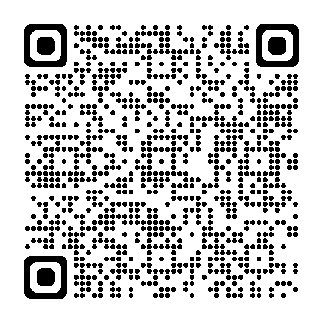

<!-- TITLE SLIDE -->

# Bachelor ThesisMaster Seminar: Labor EconomicsBachelor Seminar: Behavioral Economics in Action
### Intro Meeting

Chair of Labor and Organizational Economics Julius-Maximilians-Universität Würzburg

---
layout: default
---
<!-- # Who are we? -->

# Who are we?

Research group <strong>“Labour and Organizational Economics”</strong>:
<ul>
<li>Steffen Altmann</li>
<li>Michael Hilweg-Waldeck</li>
<li>Alessia Bogoni</li>
<li>Lorenzo Fontana</li>
</ul>

We are interested in:
<ul>
<li>Behavioral Economics</li>
<li>Experimental Economics</li>
<li>Labor Economics</li>
<li>Organizational Economics</li>
</ul>

---
layout: default
---
<!-- # Who are you? -->

# Who are you?

  <ul>
    <li>Students in B.Sc. Wirtschaftswissenschaften</li>
    <li>Students with other academic majors</li>
    <li>At the final stage of your Bachelor's program</li>
  </ul>

  <ul>
    <li class="text-amber-400 font-semibold">Master Seminar students</li>
  </ul>

  <ul>
  <li>Students in B.Sc. Wirtschaftswissenschaften</li>
  <li>Students with other academic majors</li>
  </ul>

---
layout: default
---
<!-- # What is a ... ? -->

# Bachelor thesis - your final paper
  <v-clicks>
    <ul>
      <li>Your (first) major independent research project</li>
      <li>A chance to show that you can develop, structure, and answer a research question on your own</li>
      <li>Ideally, you build on skills from seminar work, academic writing, and empirical methods</li>
      <li>A strong thesis is not only feasible, but also interesting to you and relevant for your future path</li>
    </ul>
  </v-clicks>

  <!-- CSS Grid container: stacks both parts in the exact same screen space -->
  

    <!-- PART 1: Shows up, goes through your click list, and .hide fades it out on the final click -->
    

      <h1>Bachelor Seminar - your first (?) academic paper</h1>
      
<em>How can insights from behavioral economics be applied to real-world problems in consumer decision-making, organizations, and public policy?</em>

      
In your bachelor seminar you will:

      <v-clicks>
        <ul>
          <li>Work on a concrete policy or management question</li>
          <li>Critically assess the question, using your knowledge from behavioral economics, microeconomics and econometrics</li>
          <li>Carefully interpret empirical evidence from a related research paper</li>
          <li>Identify and explain the key behavioral mechanism</li>
          <li>Develop a proposal for an own intervention or solution to address the question</li>
        </ul>
      </v-clicks>
    

    <!-- PART 2: Sits in the exact same grid slot and fades in via v-after right as Part 1 hides -->
    

      <h1 v-after>Learning goals: Academic work and communication</h1>
      <v-clicks depth="3">
        <ul>
          <li>Elaborate a focused research question in a structured and coherent way</li>
          <li>Write a seminar paper in an appropriate academic style</li>
          <li>Use academic conventions correctly, including citations and references</li>
          <li>Present your results clearly to an informed audience</li>
          <li>Strengthen the academic writing skills needed for future seminar papers and theses</li>
        </ul>
    </v-clicks>
    

  

# Master Seminar - the occasion to put into practice what you learned 

  

      In your master seminar you will: 
      <v-clicks>
      <ul>
        <li>engage deeply with modern empirical literature</li>
        <li>evaluate research methods</li>
        <li>propose alternative methods</li>
        <li>run your own project</li>
      </ul>
      </v-clicks>
  

---
layout: default
---
<!-- Prerequisites -->

  <h1 class="text-3xl font-bold mb-4">Bachelor thesis - prerequisites</h1>
  <v-clicks depth="2">
  <ul  v-clicks class="space-y-2 list-disc list-inside">
    <li>Official prerequisites: at least 100 ECTS</li>
    <li>Recommended prerequisites:
      <ul class="list-disc pl-6 space-y-1 mt-1">
        <li >You have completed a seminar paper &rarr; your thesis is not your first scholarly paper</li>
        <li >You have completed a course on academic writing &rarr; familiar with style, conventions, and citations</li>
        <li >You have completed a course in empirical methods &rarr; interpret econometric results</li>
        <li >You have completed a substantial part of your studies &rarr; in-depth understanding of economic thinking</li>
        <li class="font-bold">&rarr; Please think twice before applying if you feel you do not meet any requirements</li>
      </ul>
    </li>
  </ul>
  </v-clicks>

# Seminar prerequisites

<v-clicks depth="2">
<ul >
  <li>At an advanced stage of your Bachelor‘s program </li>
  <li>Completed course work in
  <ul>
  <li>Microeconomics</li>
  <li>Econometrics</li>
  <li>Academic writing / Wissenschaftliches Arbeiten</li>
  </ul>
  </li>
  <li>Previous courses in 
  <ul>
  <li>Behavioral Economics / Economics and Psychology</li>
  <li>Experimental Economics?</li>
  </ul>
  </li>
  </ul> 
  </v-clicks>

# Seminar prerequisites

  prerequisites ms 

---
layout: default
---
<!-- Project Objectives -->

# Bachelor Thesis - objectives 
<v-clicks depth="2">
  <ul class="space-y-2 list-disc list-inside">
    <li>You choose a research question and try to find an answer.</li>
    <li>What is expected?
      <ul class="list-disc pl-6 space-y-1 mt-1">
        <li>You conduct your own survey or experiment and collect data.</li>
        <li>Think about survey/experiment design, sampling, pool of participants, to answer the research question.</li>
        <li>The target is a (pilot) survey or experiment to test your hypotheses.</li>
        <li>Critically analyze your data: the goal is to find a well-suited presentation of preliminary findings.</li>
        <li>Relate your project to the broader topic and literature.</li>
      </ul>
    </li>
  </ul>
</v-clicks>

# Bachelor Seminar - objectives 

  

  <v-clicks depth="2">
  <ul>
  <!-- todo change pages here -->
    <li>Prepare a term paper (max. 10-15 pages)
    <ul>
      <li>Choose your research topic</li>
      <li>Critically examine the underlying policy or management problem</li>
      <li>Interpret the evidence from related research study(s) </li>
      <li>Identify and explain the key behavioral mechanisms at play</li>
      <li>Propose an original intervention to address the problem</li>
    </ul>
    </li>
    <li>Present your seminar paper in the workshop in June (≈20min)</li>
    <li>Actively engage in discussion of all other presentations</li>
    <li>Grading will be based on seminar paper and presentation, weighted 3:2</li>
  </ul>
  </v-clicks depth="2">
  

# Master Seminar - objectives 
  

  <v-clicks depth="2">
    <ul>
      <li>Option 1
        <ul>
        <li>step 1 of option1 </li>
        </ul>
      </li>
      <li>Option 2
        <ul>
        <li>step 1 of option2 </li>
        </ul>
      </li>
    </ul>
    </v-clicks depth="2">
  

---
layout: default
---

<!-- Topics -->

  

    <h1 >Master Seminar Topics - Replication</h1>
    
The following seminar topics are available for replication:

  

  

    <h1>Bachelor Seminar Topics</h1>
    
The following are suggestion topics from the literature:
    

  

  

    

      <strong>{{ item.note }}</strong> 
      <strong>{{ item.author }}</strong> ({{ item.year }}). <em>{{ item.title }}</em>.
    

  

  

    

      <strong>{{ item.note }}</strong> 
      <strong>{{ item.author }}</strong> ({{ item.year }}). <em>{{ item.title }}</em>.
    

  

  

    

    <h1>Inspiration for your bachelor thesis topic</h1>
      <v-clicks depth="2">
      <ul>
      <li>Good thesis ideas often start from real contexts you know well: student job, sports club, volunteering, student initiative.</li>
      <li>These environments give access to relevant questions, realistic settings, and participants.</li>
      <li>Examples of previous student projects:
      <ul>
        <li><strong>Choice Difficulty and Delegation in Hotel Booking:</strong> studying whether difficult choices increase willingness to delegate decisions via online survey/experiment.</li>
        <li><strong>Entrepreneurial Red Flags and Behavioral Responses:</strong> experimentally studying how founders react to negative information shocks.</li>
        </ul>
      </li>
      </ul>
      </v-clicks>
    

    

      <h1>Inspiration for your bachelor thesis topic</h1>
      
The following topics  from the literature might also be interesting for you:

      

        

          <strong>{{ item.note }}</strong> 
          <strong>{{ item.author }}</strong> ({{ item.year }}). <em>{{ item.title }}</em>.
        

      

    

  

  

---
layout: default
---
<!-- BOT/option2 topics -->

option 2 literature/idea (attention, right now only MS literature is replication package so use a idfferent method/field for this one, or change MS to MS1, MS 2)

<h1>A tool to get you up to speed</h1>

  

    
Behavioral Econ Course Assistant

    <ul class="space-y-2 text-slate-300">
      <li>Designated AI ChatBOT</li>
      <li>Trained on course materials provided in WueCampus</li>
      <li>Available through WueCampus course room</li>
      <li>Helps review or get started with key concepts, definitions, and methods</li>
      <li>Useful to catch up and get up to speed</li>
      <li><strong class="text-blue-400">Does not replace</strong> careful work with course materials and original research papers!</li>
    </ul>
  

  

    
  

---
layout: default
---

# Your Milestone Roadmap

  

    

      🗓️ {{ event.TargetDate }}
    

    
{{ event.MilestoneName }}

    

  

---
layout: default
---

# Next Steps
<v-clicks depth="2">
<ul>
<li>Think about a topic and research question that interests you.</li>
<li>Print and fill out the Project Draft form. Please bring it to the individual meeting.</li>
<li>We inform you thereafter on your topic and supervisor.</li>
<li>You can start working on your thesis.</li>
</ul>
</v-clicks>

<strong>Have a good start!</strong>

  Please ensure you fill in your <strong>Project Draft</strong> on schedule.  Check your <a href="https://alessiabogoni.github.io/seminar/roadmap.html?group=BT">roadmap</a> for the specific milestone dates.

# Next Steps
<v-clicks>
  <ul>
  <li>Select your preferred option and topic</li>
  </ul>
  </v-clicks>

  

  Please ensure you complete your <strong>Topic Selection</strong> on schedule. Check your <a href="https://alessiabogoni.github.io/seminar/roadmap.html?group=MS">roadmap</a> for specific milestone dates.

<!-- BS -->

# Next Steps
<ul>
<li>Select the research topic that interests you and a potential alternative</li>
<li>Communicate your choice (first come, first served)</li>
<li>We confirm your topic and you can start working on your term paper</li>
</ul>

<strong>Have a good start!</strong>

  Please ensure you complete your <strong>Topic Selection</strong> on schedule.  Check your <a href="https://alessiabogoni.github.io/seminar/roadmap.html?group=BS">roadmap</a> for specific milestone dates.

---
layout: default
---

<h1>Next meeting</h1>
  

    

      🗓️ {{ event.TargetDate }}
    

    
{{ event.MilestoneName }}

    

  

  
You can find these slides and all materials in the WueCampus course room &rarr; <a href="placeholder wuecampus">WueCampus</a>

