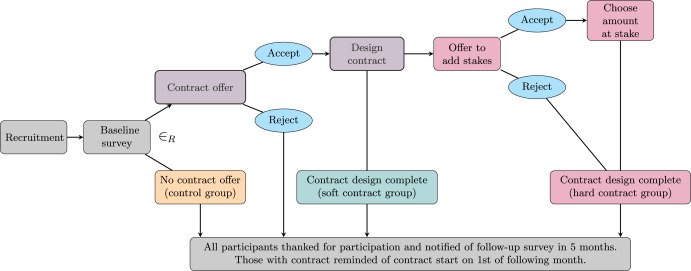
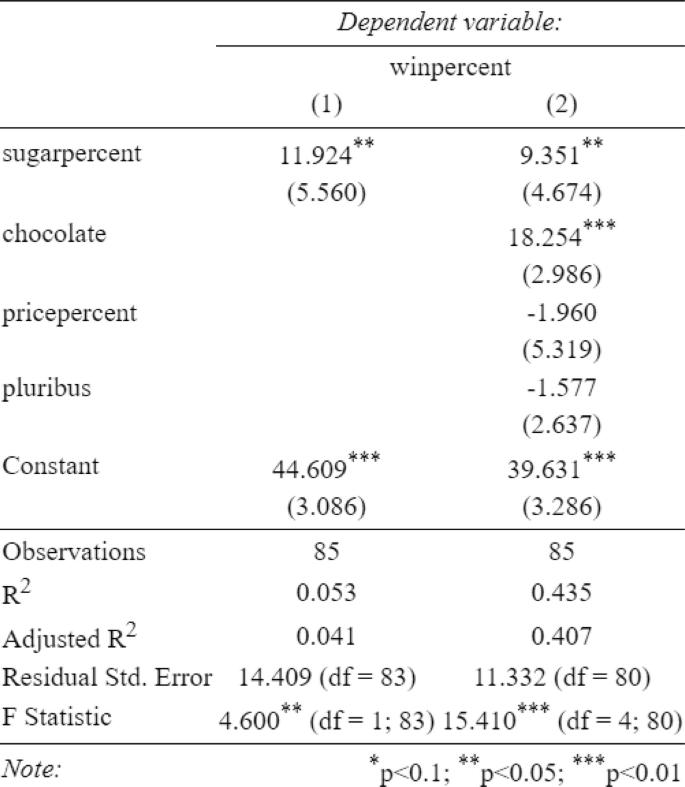
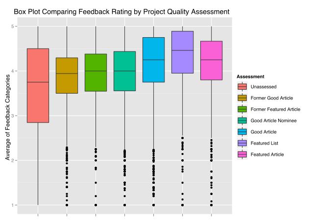
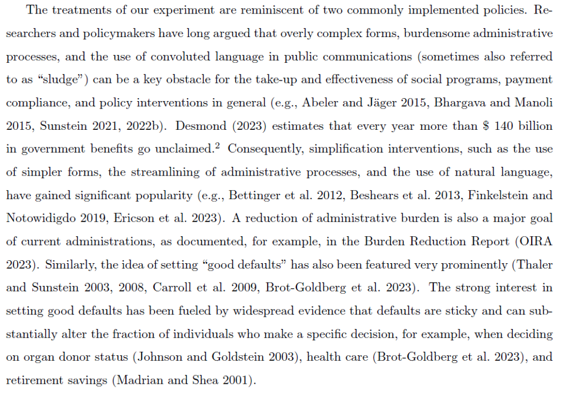
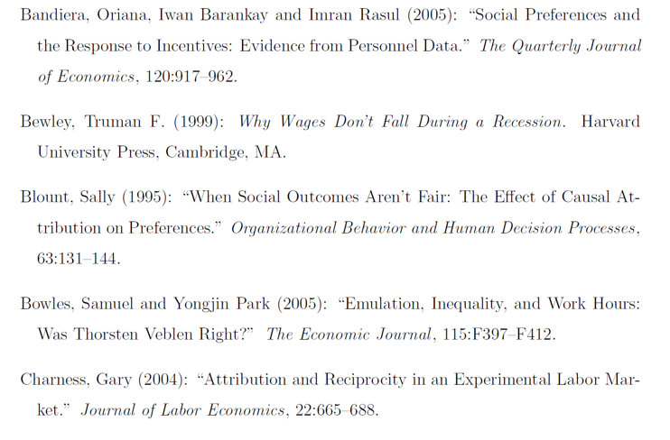

# How to Write a Paper
### Labor and Organizational Economics

Julius-Maximilians-Universität Würzburg

---
layout: default
---

# What makes a strong paper?

  <ul class="space-y-3">
    <li>A clear research question or policy/management problem</li>
    <li>One consistent storyline from start to finish</li>
    <li>Every paragraph adds value: always ask "so what?"</li>
    <li>Write for the reader, not for yourself!</li>
  </ul>

---
layout: default
---

# A simple paper storyline

  

    <strong>Introduction: question, motivation, contribution</strong>
    <ul class="pl-4 mt-1 text-slate-400 ">
      <li>Why was the study undertaken? What was the research question, the tested hypothesis or the purpose of the research?</li>
    </ul>
  

  

    <strong>Main part: theory / literature / methodology / evidence</strong>
    <ul class="pl-4 mt-1 text-slate-400 ">
      <li>When, where, and how was the study done? What materials were used and/or who was included in the study groups? What answer was found to the research question? Was the tested hypothesis true?</li>
    </ul>
  

  

    <strong>Discussion / conclusion: what the result means</strong>
    <ul class="pl-4 mt-1 text-slate-400 ">
      <li>What might the answer imply and why does it matter? How does it fit in with what other researchers have found? What are the perspectives for future research?</li>
    </ul>
  

  Keep the reader oriented throughout!

---
layout: default
---

# Structure examples for an Empirical Paper

  

    
Example A

    <ul class="space-y-1.5 text-sm">
      <li><strong>Abstract</strong></li>
      <li><strong>Introduction:</strong> Research question and motivation</li>
      <li><strong>Related Literature:</strong> What is already known and what is still open</li>
      <li><strong>Hypotheses:</strong> Clear, testable expectations</li>
      <li><strong>Experimental Design:</strong> Treatments, outcomes, randomization, sample, procedure</li>
      <li><strong>Results:</strong> What patterns would support the hypotheses</li>
      <li><strong>Practical Challenges and Limitations:</strong> Feasibility, sample issues, ethics, measurement</li>
      <li><strong>Conclusion:</strong> Contribution and next steps</li>
    </ul>
  

  

    
Example B

    <ul class="space-y-1.5 text-sm">
      <li><strong>Abstract</strong></li>
      <li><strong>Introduction:</strong> Research question, why it matters, short roadmap</li>
      <li><strong>Background / Institutional Context:</strong> Real-world problem and setting</li>
      <li><strong>Literature Review:</strong> What we already know, where this paper fits</li>
      <li><strong>Main Study:</strong> Research design, data, identification, main results</li>
      <li><strong>Critical Discussion:</strong> Strengths, limitations, external validity, alternative explanations</li>
      <li><strong>Conclusion:</strong> Main takeaway and implications</li>
    </ul>
  

---
layout: default
---

# Abstract

  Do we want an abstract for bsc seminar?

  

    
Use a simple structure:

    <ul class="space-y-1 pl-4">
      <li>Motivation</li>
      <li>Methods</li>
      <li>Results</li>
      <li>Conclusion / implications</li>
    </ul>
  

  

    
ABT Technique:

    <ul class="space-y-1.5 pl-4 ">
      <li><strong>And:</strong> give context   &rarr; also, equally, identically, like, moreover</li>
      <li><strong>But:</strong> problem/gap   &rarr; despite, however, yet, conversely, rather</li>
      <li><strong>Therefore:</strong> your contribution   &rarr; so, thus, consequently, hence, accordingly</li>
    </ul>
  

---
layout: default
---

# Abstract: Exercise

  Do we want an abstract for bsc seminar?

  Find the ABT structure in the following abstract:

  "Many eligible individuals do not claim social benefits they are entitled to, and several psychological barriers may contribute to this pattern. Yet it is unclear which barriers matter most in practice. Using an IRS field experiment with different versions of reminder mailings, the paper tests whether simplification, salience, stigma, and perceived audit or application costs affect take-up, and finds strongest support for confusion and informational complexity as key frictions."

---
layout: default
---

# Abstract: Exercise solution

  "Many eligible individuals do not claim social benefits they are entitled to, and several psychological barriers may contribute to this pattern. 
   Yet it is unclear which barriers matter most in practice. 
   Using an IRS field experiment with different versions of reminder mailings, the paper tests whether simplification, salience, stigma, and perceived audit or application costs affect take-up, and finds strongest support for confusion and informational complexity as key frictions."

---
layout: default
---

# Building the introduction

  <ul class="space-y-3">
    <li>Why does the topic matter?</li>
    <li>What do we already know?</li>
    <li>What is still missing?</li>
    <li>What does this paper do?</li>
    <li>What do we learn and why does it matter?</li>
  </ul>

---
layout: default
---

# Style, layout, figures

  <ul class="space-y-2.5">
    <li>Prefer active voice in most cases</li>
    <li>Use bold and italics sparingly</li>
    <li><strong>Hedging - using cautious language:</strong> Possibly, may, seems, appears, suggests, presumably</li>
    <li>Keep footnotes to a minimum </li>
    <li>Every figure/table must be mentioned in the text</li>
    <li>Notes explain details; interpretation belongs in the main text</li>
  </ul>

---
layout: default
---

# Tables and figures

  

    <ul class="space-y-1.5 pl-2">
      <li>regression tables</li>
      <li>charts/plots</li>
      <li>diagrams</li>
    </ul>
  

  

    
  

  

    
  

  

    
  

---
layout: default
---

# Citations and plagiarism

  <ul class="space-y-1.5">
    <li>Cite ideas, findings, and quotations from others</li>
    <li>Citations belong in the main text, not hidden in footnotes</li>
    <li>Usually cite the argument, not a literal quote</li>
    <li>Use one reference style consistently</li>
    <li><strong>If unsure: cite</strong></li>
    <li>Precise and consistent style</li>
    <li>Correct reference in body</li>
    <li>Present in references the extended list</li>
    <li>Put in the list only what is cited in the paper</li>
    <li><strong class="text-red-400">Never state out of context &rarr; risk of plagiarism!!</strong></li>
  </ul>

---
layout: default
---

# Example: Citations in text and references

  

    
  

  

    
  

---
layout: default
---

# Frontload the paper

  Use a newspaper style, not a joke style:

  <ul class="space-y-2.5">
    <li>State the main point early</li>
    <li>Then add evidence, detail, and nuance</li>
    <li>Do not make the reader guess where the paper is going</li>
  </ul>

---
layout: default
---

# Clarity at paragraph and sentence level

  <ul class="space-y-2.5">
    <li>One paragraph = one unit of thought &rarr; organize them!</li>
    <li>Use reference words and repeat key terms when helpful</li>
    <li>Put old information before new information</li>
    <li>Keep subject–verb–object close together</li>
    <li>Put emphasis at the end of the sentence</li>
  </ul>

---
layout: default
---

# Editing: where papers improve most

  <ul class="space-y-2.5">
    <li><strong>Cut clutter:</strong> Remove repetition and digressions. <strong>Quantity is not quality!</strong></li>
    <li>Check paragraph logic, not only grammar</li>
    <li>Use precise vocabulary consistently</li>
    <li><strong>Ask:</strong> would an informed reader understand the argument easily?</li>
  </ul>

  <strong>Use good connectors and precise vocabulary:</strong> Academic Phrasebank Manchester, Academic writing Nottingham

---
layout: default
---

# Using AI responsibly

  <ul class="space-y-2.5">
    <li><strong>Good uses:</strong> brainstorming, summaries, grammar/flow, formatting support</li>
    <li><strong>Bad uses:</strong> invented citations, unchecked claims, replacing your own reasoning</li>
    <li>Any AI use should be declared transparently</li>
    <li><strong>You remain responsible for accuracy and academic integrity</strong></li>
  </ul>

---
layout: default
---

# DO: AI as a consultant

  <ul class="space-y-2">
    <li>"Here is my experimental design: [Paste Outline]. Identify the strengths and weaknesses of my plan and suggest where I could be more rigorous."</li>
    <li>"I am confused by [Specific Concept/Term] in this paper. Explain how it works and give me the technical definition."</li>
    <li>"What is the difference between [Method A] and [Method B]? I need to know which one is more appropriate for my data."</li>
    <li>"I have written this paragraph. Check it for clarity and suggest how to make the tone more professional and academic."</li>
    <li>"I think my experiment might have a bias because of [Reason]. What is the correct scientific term for this problem?"</li>
  </ul>

---
layout: default
---

# DON'T: AI does the work

  <ul class="space-y-2">
    <li>"Read this paper and tell me what the main points are."</li>
    <li>"What are the flaws in the paper I have uploaded? Tell me what to write in my review."</li>
    <li>"Compare these two papers and summarize the differences between them."</li>
    <li>"Find five real papers that I can use as references for my research."</li>
    <li>"Write the introduction and the hypothesis for my paper."</li>
    <li>"Tell me what research I should do next to find a gap in this field."</li>
    <li>"Create a step-by-step experiment for me to test [Topic]."</li>
  </ul>

---
layout: default
---

# Use of Artificial Intelligence

  
The use of AI is not prohibited per se, but any parts where you use AI/chatbots, such as ChatGPT, must be marked as such.

  

    Refer to the <strong>AI Declaration</strong> document for more info and for the template table you should use to declare your AI usage.
  

---
layout: default
---

# Remember:

  <ul class="space-y-2.5">
    <li>Start early</li>
    <li>Build one clear storyline</li>
    <li>Revise several times</li>
    <li>Make your paper easy to follow</li>
  </ul>

  Clear writing is part of good research 
  „There is no great writing, only great rewriting“

---
layout: default
---

# Some extra help

  

    
UniWürzburg Schreibzentrum

    <ul class="space-y-1.5 pl-4">
      <li>Specific courses/workshops: writing, reading, presenting and so on</li>
      <li>Writing consultation</li>
      <li>Writing tutors</li>
      <li>Learning and writing groups</li>
    </ul>
  

  

    
Useful books

    <ul class="space-y-1.5 pl-4">
      <li>Deirdre McCloskey: <em>Rhetoric of Economics</em></li>
      <li>William Zinsser: <em>On Writing Well</em></li>
    </ul>
  

