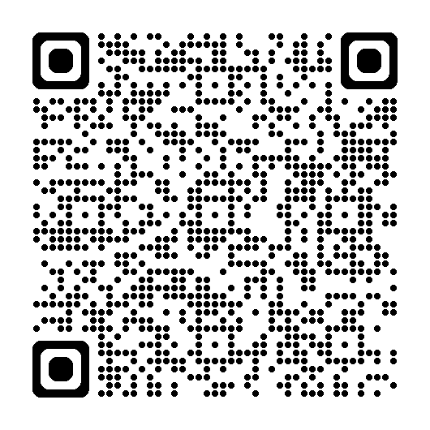

---
layout: center
class: text-center
---

# Bachelor ThesisMaster Seminar: Labor EconomicsBachelor Seminar: Behavioral Economics in Action
### Intro Meeting

Chair of Labor and Organizational Economics Julius-Maximilians-Universität Würzburg

---
layout: default
---

# Who are we?

Research group **“Labour and Organizational Economics”**:
- Steffen Altmann
- Alessia Bogoni
- Lorenzo Fontana

We are interested in:
- Behavioral Economics
- Experimental Economics
- Labor Economics
- Organizational Economics

---
layout: default
---

# Who are you?

  <ul>
    <li>Students in B.Sc. Wirtschaftswissenschaften</li>
    <li>Students with other academic majors</li>
    <li>At the final stage of your Bachelor's program</li>
  </ul>

  <ul>
    <li class="text-amber-400 font-semibold">Master Seminar students</li>
  </ul>

  <ul>
    <li class="text-amber-400 font-semibold">Bachelor Seminar students</li>
  </ul>

---
layout: default
v-if: track === 'BT'
---

# Bachelor thesis - your final paper

- Your (first) major independent research project
- A chance to show that you can develop, structure, and answer a research question on your own
- Ideally, you build on skills from seminar work, academic writing, and empirical methods
- A strong thesis is not only feasible, but also interesting to you and relevant for your future path

---
layout: default
v-if: track === 'BT'
---

# Bachelor thesis - prerequisites

- Official prerequisites: at least 100 ECTS
- Recommended prerequisites:
  - You have completed a seminar paper $\rightarrow$ your thesis is not your first scholarly paper
  - You have completed a course on academic writing $\rightarrow$ familiar with style, conventions, and citations
  - You have completed a course in empirical methods $\rightarrow$ interpret econometric results
  - You have completed a substantial part of your studies $\rightarrow$ in-depth understanding of economic thinking
  - **$\rightarrow$ Please think twice before applying if you feel you do not meet any requirements**

---
layout: default
v-if: track === 'BT'
---

# Bachelor Thesis - An Own Empirical Project

- You choose a research question and try to find an answer.
- What is expected?
  - You conduct your own survey or experiment and collect data.
  - Think about survey/experiment design, sampling, pool of participants, to answer the research question.
- The target is a (pilot) survey or experiment to test your hypotheses.
- Critically analyze your data: the goal is to find a well-suited presentation of preliminary findings.
- Relate your project to the broader topic and literature.

---
layout: default
v-if: track === 'BT'
---

# Inspiration for Your Bachelor Thesis Topic

- Good thesis ideas often start from real contexts you know well: student job, sports club, volunteering, student initiative.
- These environments give access to relevant questions, realistic settings, and participants.
- Examples of previous student projects:
  - **Choice Difficulty and Delegation in Hotel Booking:** studying whether difficult choices increase willingness to delegate decisions via online survey/experiment.
  - **Entrepreneurial Red Flags and Behavioral Responses:** experimentally studying how founders react to negative information shocks.

---
layout: default
v-if: track === 'BT'
---

# Examples from the Literature

  

    <strong>{{ item.author }}</strong> ({{ item.year }}). <em>{{ item.title }}</em>.
  

---
layout: default
v-if: track === 'BS'
---

# Bachelor Seminar Topics

The following seminar topics are available:

  

    <strong>{{ item.author }}</strong> ({{ item.year }}). <em>{{ item.title }}</em>.
  

---
layout: default
---

# A tool to get you up to speed

  

    
Behavioral Econ Course Assistant

    <ul class="space-y-2 text-slate-300">
      <li>• Designated AI ChatBOT</li>
      <li>• Trained on course materials provided in WueCampus</li>
      <li>• Available through WueCampus course room</li>
      <li>• Helps review or get started with key concepts, definitions, and methods</li>
      <li>• Useful to catch up and get up to speed</li>
      <li>• <strong class="text-blue-400">Does not replace</strong> careful work with course materials and original research papers!</li>
    </ul>
  

  

    
  

---
layout: default
---

# Your Milestone Roadmap

  

    

      🗓️ {{ event.TargetDate }}
      {{ event.ID }}
    

    
{{ event.MilestoneName }}

    

  

---
layout: default
v-if: track === 'BT'
---

# Next Steps

- Think about a topic and research question that interests you.
- Print and fill out the Project Draft form. Please bring it to the individual meeting.
- We inform you thereafter on your topic and supervisor.
- You can start working on your thesis.

**Have a good start!**

---
layout: default
v-if: track === 'BS'
---

# Next Steps

- Review your provided preliminary materials.

  Please ensure you complete your <strong>Topic Selection</strong> on schedule. Check your roadmap for specific milestone dates.

---
layout: center
class: text-center
---

# See you soon!

We look forward to seeing you at the upcoming course sessions.